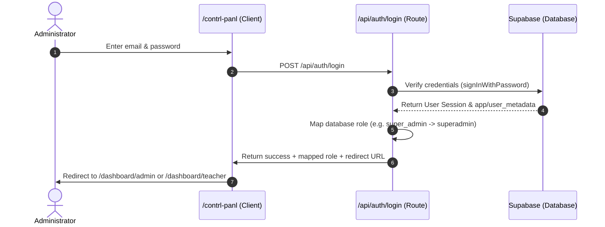

# 🛡️ MedEduAI Control Panel & Admin Login Guide

This guide documents the local Administrator Control Panel access, tested login credentials, role mappings, and backend routing configurations for **MedEduAI Ver 1**.

---

## 🚀 Accessing the Control Panel

The local development server is currently running. You can access the platform interfaces via the following URLs:

| Portal | Local URL | Port | Purpose |
| :--- | :--- | :--- | :--- |
| **Control Panel** | [http://localhost:3000/contrl-panl](http://localhost:3000/contrl-panl) | `3000` | Restricted Administrator Entry Point |
| **User Sign In** | [http://localhost:3000/login](http://localhost:3000/login) | `3000` | Standard Student/Teacher Portal |
| **Alt Port Control** | [http://localhost:3001/contrl-panl](http://localhost:3001/contrl-panl) | `3001` | Alternative Development Port |

---

## 🔑 Tested Administrator Credentials

The `setup_admins.mjs` setup script has successfully synchronized the administrative credentials with the live Supabase instance (`yrelfdwkjtaidtoulwrj`). You can use the following verified credentials to log in:

### 1. Super Admin Portal
*   **Email:** `drnarayanak@gmail.com`
*   **Password:** `Tata-Vidhya-Narayana-2026`
*   **Database Role:** `super_admin`
*   **Frontend Mapped Role:** `superadmin`

### 2. Master Admin Portal
*   **Email:** `katakepradeep11@gmail.com`
*   **Password:** `User-Akash@2026`
*   **Database Role:** `master_admin`
*   **Frontend Mapped Role:** `masteradmin`

---

## 🛠️ Role and Redirect Mappings

When you click **Access Control Panel**, the following authorization sequence takes place:



### Mapped Frontend Roles:
*   `super_admin` & `admin` & `administrator` &rarr; Mapped to `superadmin`
*   `master_admin` &rarr; Mapped to `masteradmin`
*   `institution_admin` &rarr; Mapped to `instadmin`
*   `department_admin` &rarr; Mapped to `deptadmin`

### Allowed Control Panel Roles:
Only the following normalized roles are allowed to access the Control Panel (others will see an "Access Denied" notice):
*   `superadmin`
*   `masteradmin`
*   `instadmin`
*   `deptadmin`

---

## ⚙️ Troubleshooting Login Issues

If you see an **"Invalid login credentials"** error:

1. **One-click fix (recommended).** Double-click `RESET_ADMIN_LOGIN.bat` in the
   project root. It runs `reset_admin_login.mjs`, which:
   - Validates that `.env.local` contains a usable `NEXT_PUBLIC_SUPABASE_URL`,
     anon key, and service-role key.
   - Pages through `auth.users`, creates the Super Admin / Master Admin
     accounts if missing, or resets their password + role metadata if present.
   - Upserts the matching rows in `profiles` and `users` so role lookup in
     `/api/auth/login` always resolves.
   - Performs an end-to-end `signInWithPassword` against Supabase and exits
     non-zero if the verification fails — so a green run means the credentials
     in this document will work immediately.

   From a terminal you can also run it directly:
   ```powershell
   node reset_admin_login.mjs
   ```

2. **Legacy script:** `node setup_admins.mjs` (kept for backward compatibility;
   does not verify the sign-in afterwards).

3. **Clear stale cookies / session storage:**
   Open DevTools (`F12`) &rarr; *Application* &rarr; *Cookies* and
   *Local Storage*, delete any `role`, `sb-access-token`, `sb-*-auth-token`,
   or `cp_auth` entries, then reload `/contrl-panl`.
